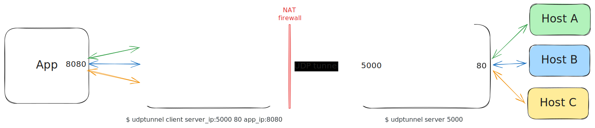

# Udptunnel

A simple UDP tunnel that allows for forwarding connections from a server with a public IP to a client behind a NAT.

## Usage

### Server

`udptunnel server <SERVER_PORT>`

### Client

`udptunnel client <SERVER_IP>:<SERVER_PORT> <SERVER_FORWARD_PORT> <LOCAL_IP>:<LOCAL_PORT>`

## Related

- [rathole](https://github.com/rapiz1/rathole)
- [frp](https://github.com/fatedier/frp)
